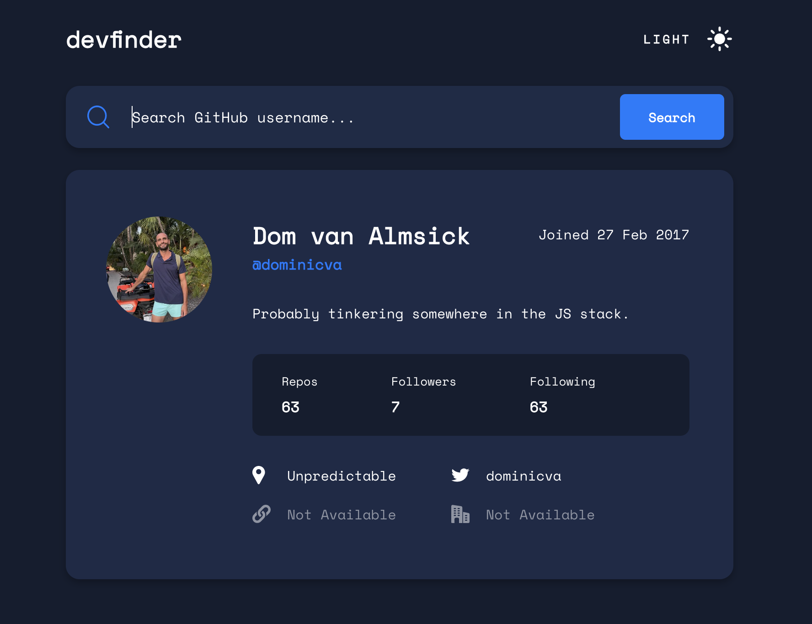
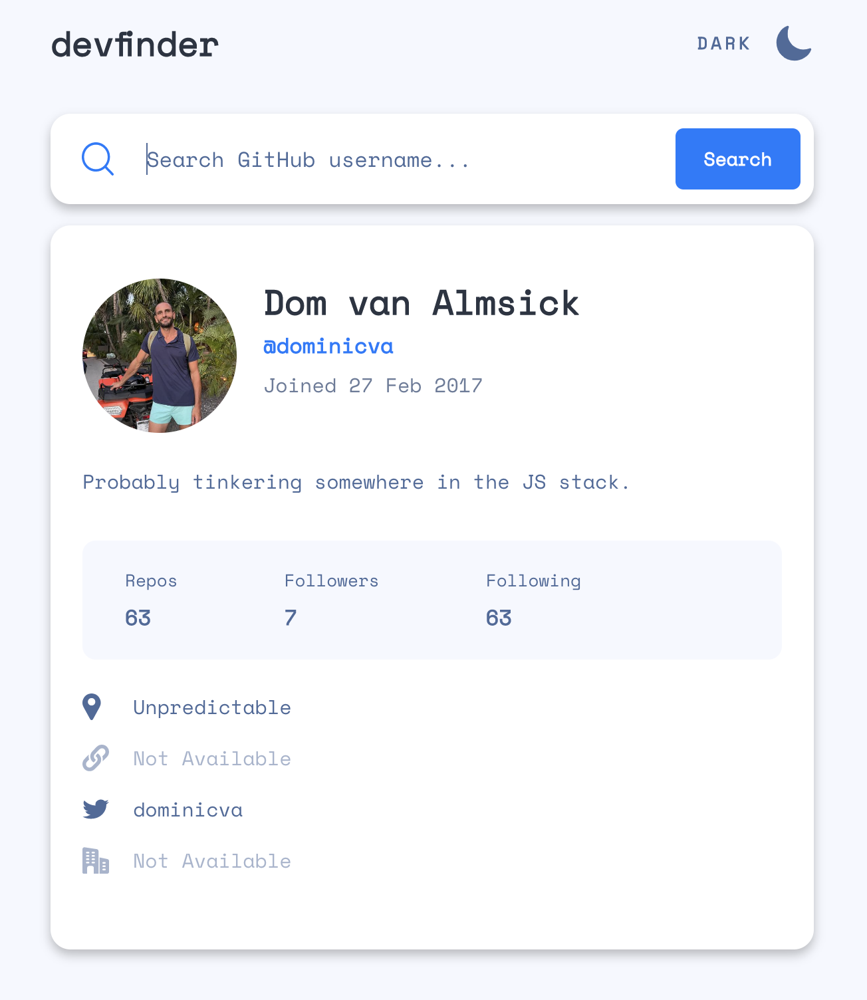

# GitHub User Search

## Table of contents

- [The idea](#the-challenge)
- [Screenshots](#screenshot)
- [Links](#links)
- [Built with](#built-with)
- [Continued development](#continued-development)

## The idea

Users should be able to:

- Have the optimal UX given their device screen size
- See hover states for interactive elements
- Search for GitHub users by username
- See relevant user information based on their search
- Switch between light and dark themes
- Have the initial color theme based on their system preferences

## Screenshots

### Dark mode in desktop view

### Light mode on medium screen

## Links

- [GitHub repo](https://github.com/dominicva/gh-user-search)
- Or check out the [live deployment](https://gh-user-search-three.vercel.app/)

## Built with

- [React](https://reactjs.org/)
- [Next.js](https://nextjs.org/)
- [Chakra UI](https://chakra-ui.com/) for styling

## Continued development

Next.js and TypeScript were maybe overkill. I could extend this by using more of their features. In terms of UX especially next.js.

1. Actually use the TypeScript language features. It's currently acting as a fancy linter 😂

2. Next.js has so many features... one example: currently when the page loads, first paint occurs before the system color preference is known. This can lead to a brief flash of one mode before the correct one. Next.js has a solution...
